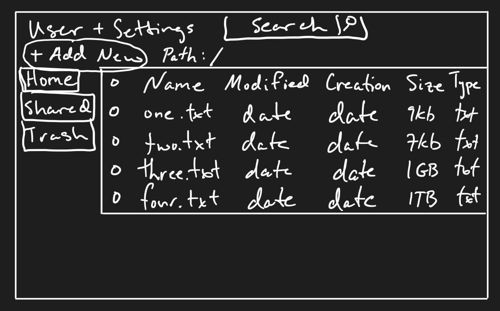

# Private File Browser / File Sharing

### Elevator pitch

If you're like me, you have photos, videos and files you want to access and share privately. With some technical know how and a few dollars a month you could host your own server and have all your files stored safely on the cloud accessible through any browser. Cloud services are expensive and there's no way to gaurentee your infomation is private. Plus, they require other people to have an account to access any files you share. In general, storing files and sharing them is tough. I plan on making self hosted cloud storage and file sharing easy and simple, whether it be from a laptop or mobile device.

### Design

### Key features

- Secure login over HTTPS
- Mobile and Desktop friend design.
- Ability to select multiple files and make custom shared collections available to guests.
- Download multiple files as zip file or separate, singular, files back to back.
- Regular and Regex file search.
- File system management built on Nodejs.

### Technologies

- **HTML** - Simple, clean HTML structure for home page and login page.
- **CSS** - Application styling that looks good on different screen sizes, color scheme, vivid and intuitive buttons.
- **JavaScript** - Provides login, window resizing, Nodejs file management, dynamic file column sorting.
- **Service** - Uses api to get icon and name based on file extension.
- **DB** - Store users credentials.
- **Login** - Register and login users. Credentials securely stored in database. Only users can access file directory and secured file collections.
- **WebSocket** - Nice connection status between you and the server
- **React** - Application ported to use the React web framework.

# HTML deliverable

- **HTML pages** - Three HTML pages. File browsing (home.html), login, and about page. Shared files will still use home.html, however they will be limited to "Guest" permissions. The "Shared" button will take you to the root directory for guests. Trash button will take you to trash directory. Both buttons will be handled by JavaScript.
- **Links** - The login page automatically links to the root directory. Password requires at least one letter and one number.
- **Text** - File metadata and details placeholders.
- **Images** - Header icon. File type icons placeholders.
- **Login** - Input box and submit button for login.
- **Database** - Users credentials used at login, and username displayed in header after login.
- **WebSocket** - Status of connection. Connected or Not connected.

# CSS deliverable

- **Header, footer, and main content body** - Bootstrapped
- **Navigation elements** - Bootstrapped
- **Responsive to window resizing** - My app looks great on all window sizes and devices
- **Application elements** - Used good contrast and whitespace
- **Application text content** - Consistent fonts
- **Application images** - Good sizes and placeholders

# JavaScript deliverable

- **login** - When you press enter or the login button it takes you to your root folder.
- **database** - Localstorage and JSON file
- **WebSocket** - Temporary clickable Connected button
- **application logic** - Sorting by each column, there are pop ups for the different options

# Service deliverable

- **Node.js/Express HTTP service** - Customized index.js and other backend js file for file handling
- **Static middleware for frontend** - Multer for file upload, archiver for zips, body-parser, cookie-parser
- **Calls to third party endpoints** - Decided to simplify because of the due date and implement a dev Chuck Noris joke api button until I can choose a file conversion api subscription.
- **Backend service endpoints** - Most express paths are done. Still lots of debugging to do. Creating folder, create file, upload folder or file, download file via URL, download, rename, move, copy, delete all work.
- **Frontend calls service endpoints** - Front ajax calls to backend

## DB deliverable

- **MongoDB Atlas database created** - All set up!
- **Endpoints for data** - They're all connected
- **Stores data in MongoDB** - Yup

# Login deliverable

- **User registration** - Creates a new account in the database and new directory for user.
- **existing user** - Logs in, takes them to home file directory.
- **Use MongoDB to store credentials** - Store login credentials
- **Restricts functionality** - They can't get passed login without a cookie and valid sessionId.

# WebSocket deliverable

- **Backend listens for WebSocket connection** - Yup
- **Frontend makes WebSocket connection** - Yup
- **Data sent over WebSocket connection** - Just need the websocket requests for connection status.
- **WebSocket data displayed** - Yup, top left.

# React deliverable

- **Bundled and transpiled** - 
- **Components** - 
- **Router** - 
- **Hooks** - 
